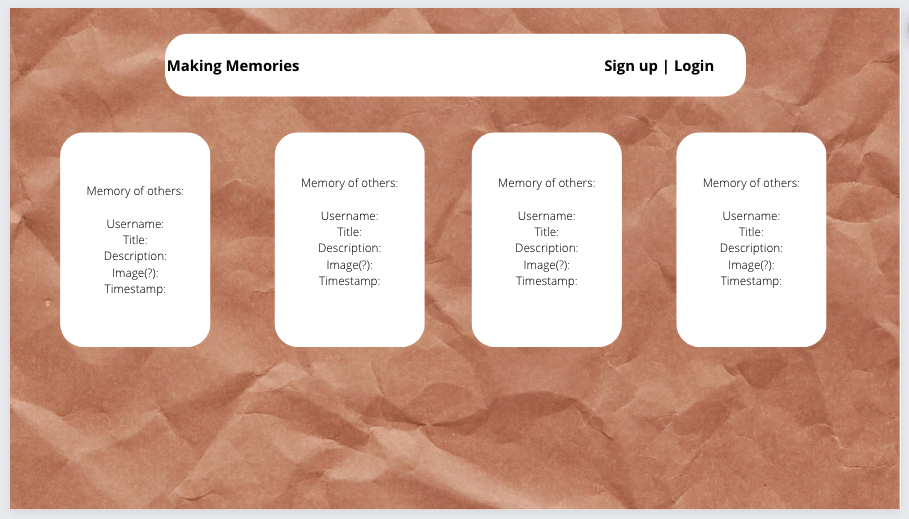
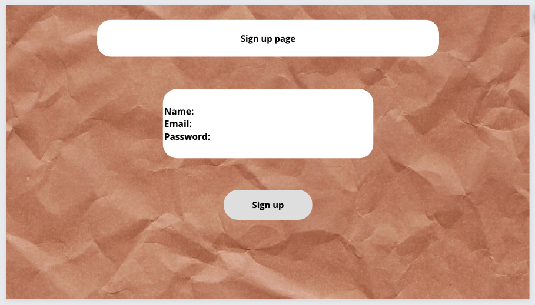
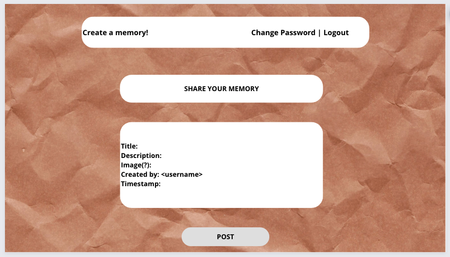
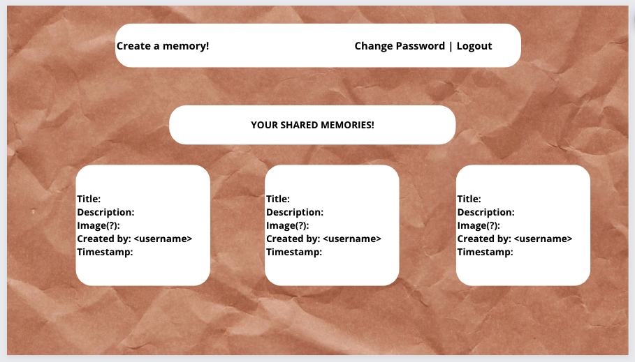
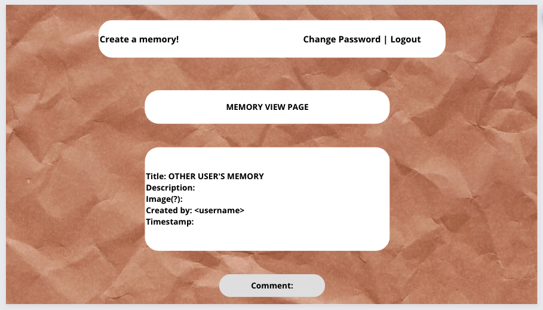
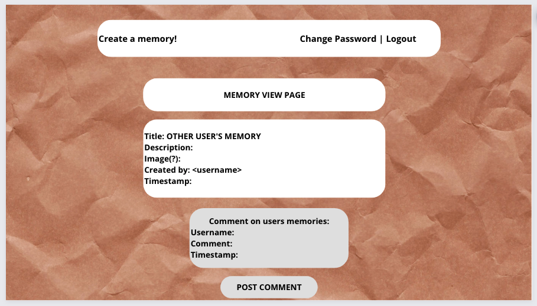
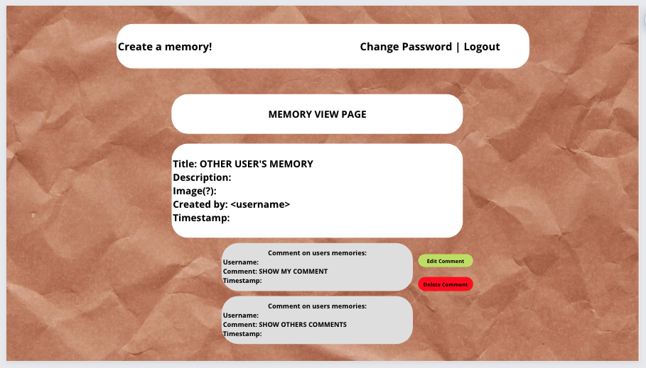
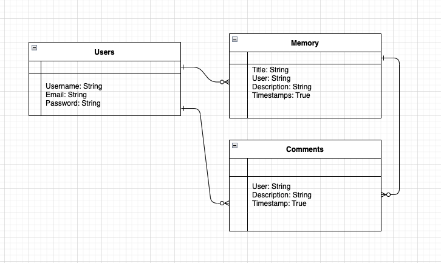

# MakingMemories-Server

### What is this app?
An app for users to log their favorite memories as well as view the memories of others. Inspired by StoryWorth in virtual form.

### Technologies Utilized
- MERN STACK
  - MongoDB
  - Express
  - React
  - Node JS

### USER STORIES
1. As a user, I want a homepage to load
2. As a user, I want to login.
3. As a user, I want to post a memory.
4. As a user, I want to update a memory.
5. As a user, I want to delete a memory.
6. As a user, I want to comment on other's memories.
7. As a user, I want to edit my comments on other's memories.
8. As a user, I want to delete my comments on other's memories.
9. As a user, I want to be able to search for memories.
10. As a user, I want to logout.

### WIRE FRAMES

### ERD

#### Making Memories Client Repo
https://github.com/arianamichele/MakingMemories-Client